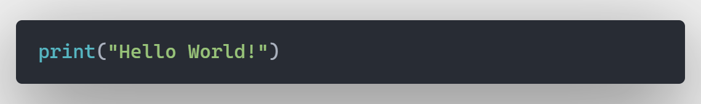

# Machine Learning Landscape :-

---


---

**Optical Character Recognition _(OCR)_** is an example rather application of Machine Learning.

> "[Machine Learning is the] field of study that gives computers the ability to learn without being explicitly programmed."
> Arthur Samuel, **1959**

- In the early days of _Intelligent_ applications, systems used hardcoded rules of “if ” and “else” decisions to process data or adjust to user input.
- The **spam filter** used a blacklist of words that would result in an email being marked as _spam_.
- However, using hardcoded rules to make decisions has two major disadvantages:
  1. The logic required to make a decision is specific to a single domain and task. Changing the task even slightly might require a rewrite of the whole system.
  2. Designing rules requires a deep understanding of how a decision should be made by a human expert.
- One example of where this hardcoded approach will fail is in detecting faces in images. Today, every smartphone can detect a face in an image.
- Using machine learning, however, simply presenting a program with a large collection of images of faces is enough for an algorithm to determine what characteristics are needed to identify a face.

# Problems ML can Solve :-

---

- The most successful kinds of machine learning algorithms are those that automate decision-making processes by generalizing from known examples _(Also called supervised learning)_. Here, the user provides the algorithm with pairs of inputs and desired outputs, and the algorithm finds a way to produce the desired output given an input.
- Machine Learning algorithms that learn from input/output pairs are called **_Supervised_** learning algorithms because a "_teacher_" provides supervision to the algorithms in the form of the desired outputs for each example that they learn from.

- Examples of supervised machine learning tasks include :
  - Identifying the zip code from handwritten digits on an envelope.
  - Determining whether a tumor is benign based on a medical image.
  - Detecting fraudulent activity in credit card transactions.

- **_Unsupervised Algorithms_** are the other type of algorithm. In unsupervised learning, only the input data is known, and no known output data is given to the algorithm. While there are many successful applications of these methods, they are usually harder to understand and evaluate.
  - Identifying topics in a set of blog posts.
  - Segmenting customers into groups with similar preferences.
  - Detecting abnormal access patterns to a website.

---
# A First Application: Classifying Iris Species

- Creating a simple machine learning application and create our first model. In the process, we will introduce some core concepts and terms.

- Our goal is to build a machine learning model that can learn from the measurements of these irises whose species is known, so that we can predict the species for a new **iris**.
- This will be a supervised learning problem as we know the correct measurement species of iris.
---
# Testing and Training Data

- Before applying an ML model to new measurements, we need to know whether it actually works ,ie. whether we should trust its predictions or not.
- But, we cannot use the data we used to train the model to evaluate new results. Because, the model will remember the data in the training set and will return the correct label (output) whenever we use it as an input.
- This can be overcome by dividing the test data in two parts -
  - One, which will be used to **_train_** the model, and
  - Second which will be used to **_test_** the model.

> One part of the data is used to build our machine learning model, and is called the training data or training set. The rest of the data will be used to assess how well the model works; this is called the test data, test set, or hold-out set.

- `scikit-learn` contains a function that shuffles the dataset and splits it for you: the `train_test_split` function. This function extracts 75% of the rows in the data as the training set, together with the corresponding labels for this data. The remaining 25% of the data, together with the remaining labels, is declared as the test set.
- In `scikit-learn`, data is usually denoted with a capital `X`, while labels are denoted by a lowercase `y`. This is inspired by the standard formulation f(x)=y in mathematics, where `x` is the input to a function and `y` is the output. Following more conventions from mathematics, we use a capital `X` because the data is a two-dimensional array (a matrix) and a lowercase y because the target is a one-dimensional array (a vector).

```Python
from sklearn.model_selection import train_test_split

X_train, X_test, y_train, y_test = train_test_split(iris_dataset['data'], iris_dataset['target'], random_state=0)
```

- Before making the split, the `train_test_split` function shuffles the dataset using a pseudorandom number generator.
- To make sure that we will get the same output if we run the same function several times, we provide the pseudorandom number generator with a fixed seed using the `random_state` parameter.
- `f(X_train/test) = y_train/test`, where X_train/test has the data which if we put in a function will give us the label / the species the iris belongs to.
- **_Example :-_** `f([5.8, 2.8 , 5.1 , 2.4] (data of X_test)) = y_test` _(Label = 2 {Virginica})_
---
# A Peek at the Data

- Before building a machine learning model it is often a good idea to inspect the data, to see if the task is easily solvable without machine learning, or if the desired information might not be contained in the data.
- One of the best ways to inspect data is to visualize it. One way to do this is by using a **_scatter plot_**.
- To create the plot, we first convert the `NumPy` array into a `pandas DataFrame`. `pandas` has a function to create pair plots called `scatter_matrix`. The diagonal of this matrix is filled with histograms of each feature:

.jpg>)

---
# Building our First Model : k-Nearest Neighbour Approach

- There are many classification algorithms in `scikit-learn` that we can use. Here we have used a `k-nearest neighbors` classifier. Building this model only consists of storing the training set. _To make a prediction for a new data point, the algorithm finds the point in the training set that is closest to the new point_. Then it assigns the label of this training point to the new data point.
- The `k` in `k-nearest neighbors` signifies that instead of using only the closest neighbor to the new data point, we can consider any fixed number `k` of neighbors in the training (for example, the closest three or five neighbors). Then, we can make a prediction using the majority class among these neighbors. In this model we have used only one single neighbor.
- All machine learning models in `scikit-learn` are implemented in their own classes, which are called `Estimator` classes.
- The `knn` object encapsulates the algorithm that will be used to build the model from the training data, as well the algorithm to make predictions on new data points. It will also hold the information that the algorithm has extracted from the training data. In the case of `KNeighborsClassifier`, it will just store the training set.
---

# Making Predictions 

- The measurements of the *new* flower are entered into a single in a two-dimensional `NumPy` array, as `scikit-learn` always expects two-dimensional arrays for the data. 
- Our model will predict the class and the class name according to the data entered.

---

# Evaluating The Model

- The test set created earlier is used to test the built model. This data was not used to train the model but the data and its corresponding label is known to us and we also know that the data is of *Iris*.
- Therefore, we can make a prediction for each iris in the test data and compare it against its label (the known species).
- Test set model predictions :
```Python
y_pred = knn.predict(X_test)
print("Test set predictions:\n {}".format(y_pred))
```
```Terminal
Output :- 
Test set predictions :
[2 1 0 2 0 2 0 1 1 1 2 1 1 1 1 0 1 1 0 0 2 1 0 0 2 0 0 1 1 0 2 1 0 2 2 1 0 2]
```

- This can be used to find how well the model performed.

```Python 
print("Test set score: {:.2f}".format(np.mean(y_pred == y_test)))
print("Test set score: {:.2f}".format(knn.score(X_test, y_test)*100))
``` 

```Terminal
Output :-
Test set score : 0.97
Test set score : 97.37
```